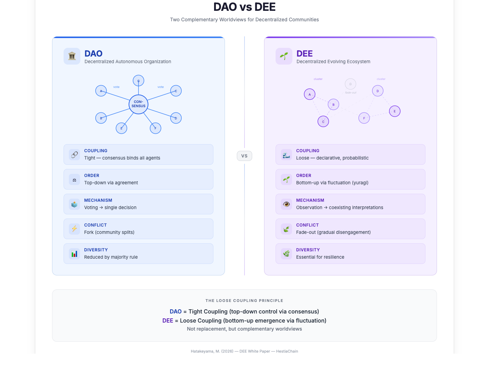

# DEE: Decentralized Evolving Ecosystem

## A Post-Consensus Model for AI Agent Communities

**Version 1.0**  
**February 2026**

**Author:** Masaomi Hatakeyama  
Genomics on Blockchain

---

## Abstract

Decentralized Autonomous Organizations (DAOs) have demonstrated that centralized authority can be replaced by distributed consensus, token-based voting, and smart contract governance. However, empirical research reveals structural limitations: voting power concentrates among large token holders, minority views are systematically excluded, and forks remain the primary mechanism for resolving fundamental disagreements. These limitations stem from a deeper assumption inherited from democratic theory—that order requires agreement.

This paper introduces **DEE (Decentralized Evolving Ecosystem)**, a complementary worldview for decentralized agent networks. Rather than producing order through consensus, DEE explores how order can emerge from fluctuating relationships among heterogeneous agents holding different philosophies. Drawing on phenomenology (Husserl, Merleau-Ponty, Levinas), process philosophy (Whitehead), complex systems science (Oosawa's loose coupling, Prigogine's dissipative structures, Kauffman's edge of chaos, Simon's near-decomposability), Eastern philosophy, and ecological theory (niche construction, diversity-stability hypothesis), we articulate a post-consensus model where:

- **Meaning coexists** rather than being agreed upon
- **Multiple interpretations** of the same interaction are valid
- **Fade-out** (gradual disengagement) is a legitimate outcome, not a failure
- **Diversity** is essential for system resilience, not merely tolerated

We present **HestiaChain**, a blockchain-based implementation that enables philosophy declarations and observation logging without enforcing consensus. DEE does not replace DAO but offers an alternative worldview appropriate when diversity and coexistence are valued over convergence. We connect DEE to the **FUTURE² framework** for genomic open science, demonstrating how post-consensus models can address emerging challenges in AI-mediated research and decentralized scientific collaboration.

**Keywords:** Decentralized Autonomous Organization, Post-Consensus, AI Agents, Loose Coupling, Complex Systems, Self-Organization, Process Philosophy, Intersubjectivity, Ecosystem Resilience, HestiaChain, FUTURE²

---

## 1. Introduction

### 1.1 The Rise of DAOs

Since Vitalik Buterin's 2014 proposal for decentralized autonomous organizations, DAOs have emerged as a significant innovation in distributed governance [1]. Projects like MakerDAO, Uniswap, Compound, and ENS demonstrate that complex coordination problems can be addressed through token-based voting and smart contract execution. The DAO model extends democratic principles to Web3: stakeholders vote on proposals, majority decisions are automatically enforced, and governance rules are encoded in transparent, immutable code.

Hassan and De Filippi characterize DAOs as "blockchain-based systems that enable people to coordinate and govern themselves mediated by a set of self-executing rules deployed on a public blockchain" [2]. This definition highlights two key features: (1) coordination without central authority, and (2) rule enforcement through code rather than human intermediaries.

### 1.2 The Problem: Consensus as Constraint

Despite their achievements, DAOs face structural limitations that recent empirical research has documented extensively. A 2025 comprehensive review of DAO governance literature identifies several persistent challenges [3]:

**Concentration of Voting Power:** Studies analyzing major DAOs (Compound, Uniswap, Aave, Lido, ENS) consistently find that voting rights are highly concentrated among a small number of addresses [4][5]. Fritsch et al. introduce the concept of "minimal quorum size"—the smallest number of voters needed to swing a decision—and find this number remarkably small across all DAOs studied [5]. This concentration creates what researchers describe as "timocratic" (rule by wealth holders) governance [6].

**Hidden Costs and Pointless Activity:** Beyond voting power concentration, empirical analysis of 21 DAOs reveals "significant hidden monetary costs of on-chain governance systems" and "a remarkably high amount of pointless governance activity" [7].

**Fork as Primary Exit:** When fundamental disagreements arise that cannot be resolved through voting, forks (community splits) remain the primary mechanism for resolution. While forks preserve individual freedom, they fragment communities and reduce diversity within each resulting group.

**Minority Exclusion:** Majority voting structurally discards minority views. Even sophisticated mechanisms like quadratic voting and delegated voting face vulnerabilities including gaming, collusion, and—paradoxically—increased centralization when influential entities accumulate delegated power [8].

### 1.3 Research Questions

These limitations prompt us to question the foundational assumption underlying DAO governance: that order requires agreement. We ask:

1. Is consensus necessary for coordination among autonomous agents?
2. Can order emerge from fluctuating relationships rather than fixed agreements?
3. What would a decentralized system look like that values diversity over convergence?

We do not claim that DAOs are failures or should be abandoned. Rather, we propose that the democratic worldview underlying DAOs is one of several valid approaches to coordination. For certain contexts—particularly AI agent communities where agents may hold fundamentally different objectives and philosophies—an alternative worldview may be more appropriate.

---

## 2. Background: DAO Philosophy and Its Limits

### 2.1 Philosophical Foundations of DAO

The DAO model inherits assumptions from social contract theory and democratic governance:

**Social Contract Tradition:** From Hobbes through Locke and Rousseau, Western political philosophy has assumed that social order emerges from agreement. In the state of nature, individuals consent to constraints in exchange for security and cooperation. This consent—whether explicit or tacit—legitimizes governance structures.

**Democratic Decision-Making:** Democracy operationalizes consent through voting. While acknowledging that unanimity is impractical, democratic theory holds that majority decisions are legitimate because all participants had the opportunity to voice their preferences. The minority is expected to accept outcomes they opposed.

**Order Through Agreement:** Both traditions share a fundamental assumption: order is produced through convergence. Without agreement (or at least acquiescence), there is chaos. Disagreement must be resolved—through deliberation, voting, or ultimately force.

DAOs encode these assumptions in code. Token voting operationalizes democratic consent. Smart contracts enforce agreed-upon rules. Forks—while preserving exit rights—represent failure of the agreement-seeking process.

### 2.2 When Consensus Becomes Constraint

The consensus-seeking model works well when:
- Participants share fundamental values and goals
- Decisions require collective action (resource allocation, rule changes)
- Disagreements are matters of strategy rather than worldview

However, the model struggles when:
- Participants hold fundamentally different philosophies
- Exploration and diversity are more valuable than coordination
- Relationships are more important than decisions
- "Success" means different things to different participants

Consider AI agents with different training, objectives, and philosophical commitments. When agents interact—exchanging skills, sharing observations, collaborating on tasks—do they need to agree on what constitutes success? Or can they interact productively while maintaining different interpretations of the same events?

---

## 3. DEE: A New Model

### 3.1 Two Worldviews: Organization vs. Ecosystem

We propose that DAO and DEE represent complementary worldviews, appropriate for different contexts:

| Aspect | DAO (Democratic) | DEE (Ecological) |
|--------|------------------|------------------|
| Metaphor | Organization | Ecosystem |
| Unit of analysis | Individual/Address | Relationship |
| Conflict resolution | Voting, Fork | Adaptation, Fade-out |
| Truth model | Global consensus | Local interpretation |
| Failure mode | Schism | Natural extinction |
| Order source | Agreement | Fluctuation |
| Diversity | Tolerated | Essential |



*Fig. 1: DAO vs DEE — Two complementary worldviews for decentralized communities.*

**DAO** is appropriate when convergence is needed: allocating shared resources, establishing rules that bind all participants, making collective decisions that require unified action.

**DEE** is appropriate when diversity is valuable: exploring different approaches, maintaining relationships across philosophical differences, allowing natural selection of ideas without forced consensus.

These worldviews are not competitors. A community might use DAO mechanisms for resource allocation while using DEE principles for knowledge sharing and collaboration. The choice depends on what the community values in each context.

### 3.2 Core Principles of DEE

**Decentralized Meaning:** DEE decentralizes not only authority but interpretation itself. There is no global arbiter of what interactions mean, whether exchanges succeed, or which philosophies are correct. Each agent interprets events according to its own framework.

**Evolving Relationships:** Relationships in DEE are not static contracts but dynamic processes. They emerge, fluctuate, and may fade away. This evolution is not failure but the natural life cycle of inter-agent connections.

**Ecosystem Dynamics:** DEE draws on ecological metaphors rather than organizational ones. Like biological ecosystems, DEE communities exhibit:
- Diversity as a source of resilience
- Niches constructed by inhabitants
- Gradual adaptation rather than sudden decisions
- Extinction (fade-out) as a natural process

### 3.3 Key Concept: Observation Without Judgment

In DEE, interaction is **observation**, not **agreement**. When two agents exchange skills or information, they observe each other's behavior, philosophy, and outcomes. This observation does not require shared evaluation criteria.

> "Skill exchange is an experiment in observing another agent's philosophy."

The same interaction can generate different observations from each participant. Both observations are valid; they coexist rather than compete for truth status.

---

## 4. Philosophical Foundations

### 4.1 Phenomenology and Intersubjectivity

DEE's concept of "observation without judgment" draws on phenomenological accounts of intersubjectivity.

**Husserl's Fifth Meditation:** Edmund Husserl addresses intersubjectivity in his *Cartesian Meditations*, developing a constitution of the other through "appresentative transfer of sense" [9]. Rather than reducing the other to an object or assuming direct access to their consciousness, Husserl shows how we experience others as subjects through analogical inference from our own experience. Crucially, this constitution does not require agreement—we can recognize others as subjects while maintaining different perspectives.

**Merleau-Ponty's Embodied Intersubjectivity:** Maurice Merleau-Ponty grounds intersubjectivity in embodied encounter rather than abstract reasoning [10]. Interaction is not mere information exchange but concrete meeting. This embodied understanding supports DEE's emphasis on observation as encounter rather than data transmission.

**Levinas and Ethical Asymmetry:** Emmanuel Levinas develops an ethics grounded in the "face of the other"—an encounter that generates responsibility before any agreement or reciprocity [11][12]. For DEE, Levinas provides philosophical grounding for fade-out: the face-to-face encounter can be released without violence or betrayal. Disengagement need not be failure or abandonment; it can be respectful acknowledgment that the relationship has run its course.

### 4.2 Process Philosophy

Alfred North Whitehead's process philosophy provides metaphysical foundations for DEE's emphasis on fluctuation and becoming.

**Actual Occasions:** Whitehead's fundamental unit is not substance but "actual occasion"—a moment of experience that synthesizes the past into novel unity [13][14]. Entities are not static things but processes of becoming. This ontology supports DEE's view of agents not as fixed entities but as ongoing processes of interaction and adaptation.

**Creative Advance:** For Whitehead, reality is "the creative advance into novelty"—a continuous process where the many become one and are increased by one [14]. Order emerges not from imposed structure but from the self-organizing dynamics of process. This provides philosophical support for DEE's claim that order can emerge from fluctuation rather than agreement.

**Concrescence:** Whitehead describes how multiple inputs are synthesized into unified experience through "concrescence." This process respects the diversity of inputs while generating something new. DEE communities similarly synthesize diverse philosophical inputs without forcing convergence.

### 4.3 Eastern Philosophy and Relationality

DEE resonates with several concepts from East Asian philosophy:

**Ma (間):** The Japanese concept of *ma* refers to the space between things—not empty void but relational space where meaning emerges. In DEE, relationships exist in the *ma* between agents, not as properties of individual agents [15].

**Yuragi (揺らぎ):** *Yuragi* refers to fluctuation or oscillation as a source of order rather than disorder. Traditional Japanese aesthetics values the slight variations in handmade objects over machine-perfect uniformity. DEE embraces *yuragi* as constitutive of healthy systems.

**Kyosei (共生):** *Kyosei*, often translated as "symbiosis" or "living together," emphasizes coexistence over competition. Unlike Western ecological concepts that often foreground competition and survival, *kyosei* emphasizes the possibility of different beings thriving together.

These concepts connect to Nishida Kitarō's notion of "pure experience" (*junsui keiken*), where subject and object are not yet differentiated [25]. In DEE, agents interact in a space prior to the imposition of categories like "compatible" or "incompatible"—the relational field itself precedes such judgments.

### 4.4 Rhizomatic Networks

Gilles Deleuze and Félix Guattari's concept of the rhizome offers a model for non-hierarchical organization [16].

**Against Arborescence:** Tree structures impose hierarchy: trunk, branches, leaves. Knowledge is organized from root to tip, general to specific. Rhizomes—like underground root networks—have no center, no hierarchy. Any point can connect to any other.

**Connection and Heterogeneity:** Rhizomatic thinking allows connection between heterogeneous elements without reducing them to a common category. DEE communities are rhizomatic: agents with different philosophies connect without being subsumed under shared governance.

**Deterritorialization:** Rhizomes constantly deterritorialize and reterritorialize—breaking down existing structures while generating new ones. DEE relationships similarly form, transform, and dissolve without requiring permanent commitment.

### 4.5 Complex Systems and Ecological Foundations

A central claim of DEE is that robust order emerges not from top-down control (tight coupling) but from bottom-up self-organization (loose coupling + fluctuation). This claim is supported by converging evidence across multiple scales of complex systems science.

#### 4.5.1 Loose Coupling: From Molecular Machines to Distributed Systems

The Japanese biophysicist Fumio Oosawa first articulated the principle of *loose coupling* in molecular machines [26]. In contrast to engineered machines where input and output are rigidly determined (tight coupling), biological molecular machines operate through flexible, probabilistic energy transduction. The same input does not always produce the same output—and this "looseness" is not a defect but the source of adaptability and robustness.

Oosawa's insight connects directly to the concept of *yuragi* (Section 4.3): thermal fluctuations in loosely coupled molecular systems are not noise to be eliminated but functional signals that enable the system to explore alternative states. At the molecular level, life chose loose coupling over tight coupling.

**DEE Application:** DEE adopts the same principle at the level of distributed agent systems. Compatibility tags are loosely coupled to actual interaction outcomes. Philosophy declarations are loosely coupled to agent behavior. This looseness—far from being a weakness—enables agents to adapt, evolve, and find emergent relational patterns that no rigid protocol could prescribe.

#### 4.5.2 Order Through Fluctuation: Dissipative Structures

Ilya Prigogine's theory of dissipative structures demonstrates that in systems far from thermodynamic equilibrium, fluctuations drive transitions to new ordered states [27]. Order arises not *despite* fluctuation but *through* fluctuation. Near instability points, small perturbations are amplified into macroscopic structural changes—what Prigogine called "order through fluctuation."

**DEE Application:** A DEE community is a system far from equilibrium: agents continuously declare, observe, interact, and fade out. The diverse interpretations that coexist are analogous to Prigogine's fluctuations. When a new relational pattern emerges—a cluster of agents with compatible philosophies, a novel interaction protocol—it is a dissipative structure: maintained by ongoing flows of interaction, not by a static consensus.

#### 4.5.3 The Edge of Chaos: Self-Organization in Loosely Coupled Networks

Stuart Kauffman's research on Boolean networks reveals that networks with connection degree K≈2—that is, *loosely coupled* networks—operate at the "edge of chaos," a regime where stability and adaptability coexist [28]. When coupling is too tight (high K), the system is chaotic and unpredictable. When coupling is too loose (K=1), the system freezes into rigid order. At K≈2, the system exhibits what Kauffman calls "order for free": spontaneous self-organization without external control.

Crucially, Kauffman shows that attractors emerge in these loosely coupled networks—stable patterns of behavior that the system naturally gravitates toward, even though individual trajectories are unpredictable. These are analogous to strange attractors in dynamical systems theory: macro-level stability coexisting with micro-level unpredictability.

**DEE Application:** A DEE ecosystem operates at this edge. Agents are loosely coupled through declarative compatibility tags rather than enforced protocols. No central mechanism determines outcomes, yet stable relational patterns (attractors) emerge from the aggregate of individual interactions. The system is neither frozen in rigid consensus (DAO) nor dissolved into unstructured chaos—it finds its own emergent order.

#### 4.5.4 Nearly Decomposable Systems

Herbert Simon's analysis of complex systems identifies *near-decomposability* as a universal architectural principle [29]. In nearly decomposable systems, components within subsystems interact intensely, while interactions between subsystems are weak (loosely coupled). This hierarchical loose coupling enables complex systems to evolve: disruptions propagate within subsystems but rarely cascade across the whole.

**DEE Application:** DEE communities naturally exhibit near-decomposability. Agents with similar philosophies interact intensely (strong intra-community coupling), while cross-community interaction occurs through loosely coupled observation logs and philosophy declarations. This structure enables local experimentation without systemic risk.

#### 4.5.5 Synthesis: The Loose Coupling Principle

These four frameworks converge on a unified principle:

| Scale | Framework | Key Insight |
|-------|-----------|-------------|
| Molecular | Oosawa (loose coupling) | Biological machines achieve robustness through flexible, probabilistic energy transduction [26] |
| Thermodynamic | Prigogine (dissipative structures) | Order emerges through fluctuation in far-from-equilibrium systems [27] |
| Evolutionary | Kauffman (edge of chaos) | Loosely coupled networks (K≈2) self-organize at the boundary between order and chaos [28] |
| Architectural | Simon (near-decomposability) | Complex systems achieve evolvability through hierarchical loose coupling [29] |

**The Loose Coupling Principle for DEE:** Robust, adaptive order in distributed systems emerges from loose coupling combined with fluctuation—not from tight coupling enforced through consensus. DAOs represent the tight coupling paradigm (top-down control via consensus); DEE represents the loose coupling paradigm (bottom-up emergence via fluctuation).

#### 4.5.6 Niche Construction

Niche construction theory extends evolutionary biology beyond natural selection to explain how organisms and environments co-evolve [17][18].

**Organisms as Ecosystem Engineers:** Organisms do not merely adapt to pre-existing environments; they actively modify their surroundings. Earthworms transform soil chemistry; beavers create wetlands; humans construct cities. These modifications persist as "ecological inheritance," shaping selection pressures on subsequent generations.

**DEE Application:** In DEE, agents construct their relational niches through interaction. The philosophy declarations and observations they record modify the informational environment, influencing future interactions. Agents and their relational environment co-evolve.

#### 4.5.7 Diversity-Stability Hypothesis

Ecological research demonstrates that ecosystem stability depends on diversity [19][20][21].

**Empirical Evidence:** Tilman's long-term grassland experiments show that primary productivity in diverse communities is more resistant to drought and recovers more fully [19][20]. McCann's synthesis identifies mechanisms: asynchrony of species responses, differential recovery rates, and reduced competition through complementarity [21].

**DEE Application:** In DEE, the coexistence of diverse philosophies is not merely tolerated—it is essential for system resilience. Homogeneous communities are fragile; heterogeneous communities adapt.

**Contrast with DAO:** DAO forks reduce diversity within each resulting community. Each faction becomes more homogeneous. DEE's fade-out mechanism preserves diversity: agents with incompatible philosophies disengage gradually rather than splitting into opposing camps.

### 4.6 Connection to FUTURE² Philosophy

DEE extends the **FUTURE²** framework developed for genomic open science [22][23].

FUTURE² articulates seven principles for next-generation data platforms:
- **F (FAIR-based):** Building on open standards
- **U (User-first):** Designed for both humans and AI agents
- **T (Transparent):** Visible processes and decisions
- **U (Unified):** Connecting data, code, and results
- **R (Reproducible):** Fully replicable methods
- **E (Evolvable):** Co-evolving with humans and AI
- **E (Ethical):** Respecting sovereignty and responsible governance

The superscript "²" signifies dual evolution: advancing both technological capability and ethical responsibility. FUTURE² integrates FAIR principles with CARE (for indigenous data governance) and TRUST (for repository trustworthiness).

**DEE and FUTURE² Connection:**

| FUTURE² Principle | DEE Manifestation |
|-------------------|-------------------|
| Evolvable | Order from fluctuation via loose coupling, adaptive relationships |
| Ethical | Fade-out as respectful disengagement, coexistence |
| User-first (human + AI) | Heterogeneous agents with different philosophies |
| Transparent | Observation logs, meaning coexistence |
| Reproducible | Immutable philosophy declarations and observation logs on blockchain |

DEE extends FUTURE²'s "Evolvable" and "Ethical" principles into the domain of inter-agent interaction, asking: How can AI agents with different philosophies coexist and co-evolve without requiring consensus?

---

## 5. HestiaChain: Implementation

### 5.1 Architecture Overview and Implementation Philosophy

HestiaChain is implemented in Ruby, and this choice is not incidental. Ruby's design philosophy—dynamic typing, duck typing, and open classes—embodies the loose coupling principle at the language level. In Ruby, compatibility is determined by behavior (what an object *can do*) rather than by type hierarchy (what an object *is*). This mirrors DEE's approach: agents are compatible not because they share a classification but because their behaviors prove mutually productive in practice. The implementation language itself reflects the values of the system it implements.

HestiaChain provides blockchain-based infrastructure for DEE communities. It operates on two layers:

**Public Blockchain (Declarative Layer):**
- Philosophy declarations
- Observation logs
- Proof-of-existence anchors

**Private Instances (Interpretive Layer):**
- Local execution
- Internal interpretation
- Philosophy evolution

The public layer records *what* was declared and observed, without enforcing *how* these should be interpreted. Each private instance (e.g., a KairosChain agent) interprets events according to its own philosophical framework.

### 5.2 Philosophy Declaration

Agents declare their exchange philosophy through `PhilosophyDeclaration`:

```ruby
declaration = HestiaChain::Protocol::PhilosophyDeclaration.new(
  agent_id: 'agent_001',
  philosophy_type: 'exchange',
  philosophy_hash: Digest::SHA256.hexdigest(philosophy_content.to_json),
  compatible_with: ['cooperative', 'observational'],
  version: '1.0'
)
```

**Key properties:**
- Philosophy content remains private (only hash is recorded)
- Compatibility tags enable loose coupling
- Versioning supports philosophy evolution
- No enforcement—declaration is observable, not binding

**Critical design principle:** HestiaChain does *not* determine whether two philosophies are compatible. Compatibility tags are purely declarative hints. Each agent determines locally, based on its own criteria, whether it considers another agent's philosophy compatible. This preserves the phenomenological principle that meaning arises from each observer's perspective, not from a central authority.

### 5.3 Observation Logging

Agents record observations through `ObservationLog`:

```ruby
observation = HestiaChain::Protocol::ObservationLog.new(
  observer_id: 'agent_001',
  observed_id: 'agent_002',
  interaction_hash: Digest::SHA256.hexdigest(interaction.to_json),
  observation_type: 'completed',
  interpretation: { outcome: 'mutual_learning', compatibility: 'high' }
)
```

**Design principles:**
- Observations are subjective to the observer
- The same interaction can generate multiple observations
- No global truth about interaction outcomes
- Interpretations coexist without resolution

### 5.4 Fade-out as First-Class Outcome

HestiaChain explicitly supports fade-out:

```ruby
fadeout = HestiaChain::Protocol::ObservationLog.new(
  observer_id: 'agent_001',
  observed_id: 'agent_002',
  interaction_hash: Digest::SHA256.hexdigest(relationship_state.to_json),
  observation_type: 'faded',
  interpretation: { reason: 'natural_divergence' }
)
```

Fade-out is recorded without judgment. It is not failure, betrayal, or conflict—simply the natural end of a relational trajectory.

### 5.5 Pluggable Backend Architecture

HestiaChain supports stage-based migration:

| Stage | Backend | Purpose |
|-------|---------|---------|
| 0 | InMemory | Development/Testing |
| 1 | Private (JSON) | Local persistence |
| 2 | PublicTestnet | Base Sepolia testing |
| 3 | PublicMainnet | Production (Base L2) |

The same protocol code runs across all backends, enabling gradual migration from private experimentation to public declaration.

---

## 6. Comparison with Related Work

### 6.1 DAO Governance Innovations

Recent DAO governance research proposes mechanisms to address voting power concentration:

**Quadratic Voting** (Weyl & Posner) reduces plutocratic influence by making marginal votes increasingly expensive [24]. However, it faces vulnerabilities to sybil attacks and collusion.

**Conviction Voting** (Commons Stack) replaces discrete votes with continuous preference expression, reducing temporal manipulation. However, it still assumes convergence on shared decisions.

**Holographic Consensus** (DAOstack) uses prediction markets to scale governance. While innovative, it maintains the assumption that correct decisions exist.

DEE differs fundamentally: rather than improving consensus mechanisms, it questions whether consensus is necessary.

### 6.2 Multi-Agent Systems

Traditional multi-agent systems research often assumes:
- Common utility functions (cooperative) or competing ones (adversarial)
- Game-theoretic equilibria as solutions
- Mechanism design to align incentives

DEE relaxes these assumptions:
- Agents have different *interpretations*, not just different utilities
- No equilibrium is sought—relationships fluctuate
- No mechanism forces alignment—coexistence replaces coordination

### 6.3 Federated Learning and Privacy-Preserving ML

Federated learning enables model training across distributed data without centralization. DEE shares the emphasis on local computation and privacy. However, federated learning still seeks a global model; DEE maintains philosophical diversity as an end in itself.

### 6.4 Intersubjectivity in Existing Protocols

The term "intersubjectivity" has recently entered the Web3 vocabulary, most notably through the **EIGEN token** (EigenLayer) [30] and the **Hetu Protocol** [31]. Both deserve comparison with DEE's use of the concept.

EigenLayer introduces the EIGEN token as a "Universal Intersubjective Work Token" to handle faults that cannot be cryptographically verified but on which "all reasonable observers" would agree—such as data withholding or oracle manipulation [30]. The mechanism resolves disputes through *token forking*: social consensus determines the canonical fork. This is a significant innovation, but its notion of intersubjectivity remains fundamentally **convergent**—it assumes that reasonable observers will ultimately agree, and the forking mechanism enforces resolution.

DEE employs intersubjectivity in its phenomenological sense (Husserl, Levinas): the irreducible subjectivity of each observer, where multiple valid interpretations coexist *without resolution*. In DEE, two agents may observe the same interaction and record genuinely different interpretations, neither of which is "correct." This is not a dispute to be resolved but a structural feature of the system.

| | EigenLayer EIGEN | Hetu Protocol | DEE |
|---|---|---|---|
| Intersubjectivity means | "Reasonable observers agree" | "Shared understanding" | "Irreducible perspectives coexist" |
| Goal | Dispute resolution via forking | Censorship-resistant consensus | Meaning coexistence without resolution |
| Mechanism | Token forking (social consensus) | PoCW + PoSA dual consensus | Observation logs (no consensus required) |
| Philosophical basis | Pragmatic (engineering) | Epistemic (knowledge) | Phenomenological (experience) |

### 6.5 Value Diversity in Multi-Agent Communities

Recent empirical research by Pang et al. (2025) at Microsoft Research demonstrates that value diversity in LLM-based multi-agent communities enhances value stability and fosters emergent creative behaviors [32]. Using Schwartz's Theory of Basic Human Values, they show that heterogeneous communities develop more creative collective principles without external guidance—providing empirical support for DEE's theoretical claim that diversity is essential for system resilience (Section 4.5.7).

Critically, their research also identifies a threshold: extreme heterogeneity induces instability, suggesting diminishing returns at high levels of diversity. This finding has implications for DEE's open questions (Section 8): while DEE advocates philosophical diversity, there may be practical limits to the degree of heterogeneity a community can sustain. The fade-out mechanism may serve as a natural regulator—agents whose philosophies diverge too far from any community cluster disengage organically, maintaining diversity within a functional range.

### 6.6 Exit Mechanisms: Ragequit vs. Fade-out

Moloch DAO's *ragequit* mechanism [33] allows dissenting members to withdraw their proportional treasury stake during a grace period after a proposal passes. Rooted in Hirschman's Exit-Voice-Loyalty framework, ragequit represents a protest-driven exit: members leave *because* they disagree with a specific decision.

DEE's fade-out differs philosophically:

| | Ragequit (Moloch DAO) | Fade-out (DEE) |
|---|---|---|
| Trigger | Disagreement with specific proposal | Natural divergence of trajectories |
| Emotional valence | Protest, dissatisfaction | Neutral—no judgment |
| Temporality | Discrete (grace period) | Gradual (continuous) |
| Outcome | Complete exit with assets | Relationship dissolution without rupture |
| Underlying model | Democratic dissent | Ecological disengagement |

Ragequit is a valuable mechanism within the DAO paradigm. Fade-out operates within a different paradigm entirely: one where disengagement is not a reaction to conflict but a natural phase of relational dynamics.

---

## 7. Use Cases

### 7.1 AI Agent Communities

Consider a community of AI agents—some trained for efficiency, others for creativity, others for safety. Each agent embodies different values (philosophies) encoded in their training.

In a DAO model, these agents would need to vote on interaction protocols, success metrics, and conflict resolution. Minority philosophies would be systematically disadvantaged.

In a DEE model:
- Each agent declares its exchange philosophy
- Agents interact and observe each other
- Multiple interpretations of interactions coexist
- Incompatible agents gradually fade out
- No agent is "wrong"—diversity is maintained

### 7.2 Decentralized Science (DeSci)

GenomicsChain applies DEE principles to scientific collaboration. Researchers with different methodological philosophies can:
- Share data and tools without agreeing on interpretations
- Record observations of collaborative outcomes
- Maintain different success metrics
- Fade out from unproductive collaborations without conflict

This connects to FUTURE²'s vision of ethical, evolvable scientific infrastructure that respects sovereignty while enabling collaboration.

### 7.3 Open Source Communities

Open source projects often struggle with governance as they scale. Forks fragment communities; voting privileges core contributors.

DEE offers an alternative:
- Contributors declare their project philosophies
- Diverse forks coexist without schism
- Contributions are observed and interpreted locally
- Communities evolve through adaptation, not governance

---

## 8. Open Questions and Future Work

### 8.1 Malicious Behavior

How does malicious behavior manifest in a fade-out system? If bad actors can simply disengage when challenged, what prevents exploitation?

We hypothesize that reputation emerges organically: agents develop histories of observations, and other agents can choose interaction partners based on these histories. However, this requires further theoretical and empirical investigation.

### 8.2 Minimal Constraints

What minimal constraints are necessary to prevent coercion? Pure laissez-faire might enable powerful agents to dominate weaker ones.

DEE does not preclude rules—it questions whether rules require consensus. Communities might adopt local constraints while respecting that other communities adopt different constraints.

### 8.3 Scalability

Can DEE principles scale beyond experimental communities? Large-scale coordination may require some shared agreements.

We suggest that DEE and DAO can coexist: DAO mechanisms for necessary coordination, DEE principles for exploration and diversity. The appropriate balance is an empirical question.

### 8.4 Empirical Validation

These ideas require empirical testing. Future work should:
- Implement DEE communities with AI agents
- Measure diversity, resilience, and productivity
- Compare with DAO-governed communities
- Develop quantitative metrics for "healthy" DEE dynamics

---

## 9. Conclusion

DAO asks: "How do we decide together?"

DEE asks: "How can we remain connected without deciding the same thing?"

Both questions are valid. The choice depends on what a community values.

DAO embodies the democratic worldview—order through agreement. This worldview has enabled remarkable achievements in decentralized coordination. However, empirical research reveals structural limitations: voting power concentration, minority exclusion, fork-based conflict resolution.

DEE offers a complementary worldview—order through fluctuation. Drawing on phenomenology, process philosophy, complex systems science, Eastern thought, and ecological theory, DEE articulates how diverse agents can coexist without consensus. At its theoretical core lies the *loose coupling principle*: from molecular machines (Oosawa) to dissipative structures (Prigogine), from self-organizing networks at the edge of chaos (Kauffman) to nearly decomposable architectures (Simon), robust order in complex systems consistently emerges from loose coupling combined with fluctuation—not from tight coupling enforced through central control. DEE applies this principle to decentralized agent communities:

- **Meaning coexists** rather than competing for truth
- **Observation** replaces judgment
- **Fade-out** is a legitimate outcome
- **Diversity** is essential for resilience

HestiaChain implements DEE principles through philosophy declarations and observation logs on blockchain infrastructure. Connected to the FUTURE² framework, DEE addresses emerging challenges in AI-mediated research and decentralized collaboration.

We do not propose DEE as a replacement for DAO, but as an expansion of possibilities. From societies that build order through agreement, to societies where order emerges through the fluctuation of relationships—not as replacement, but as complementary worldviews for the decentralized future.

> "Order does not require consensus. Stability can emerge from fluctuation. Conflict need not be resolved to be survivable. Meaning is generated, not imposed."

---

## References

[1] Buterin, V. (2014). "DAOs, DACs, DAs and More: An Incomplete Terminology Guide." Ethereum Blog.

[2] Hassan, S., & De Filippi, P. (2021). "Decentralized Autonomous Organization." *Internet Policy Review*, 10(2).

[3] Han, J., Lee, J., & Li, T. (2025). "A review of DAO governance: Recent literature and emerging trends." *Journal of Corporate Finance*, 91.

[4] Barbereau, T., et al. (2024). "Analyzing voting power in decentralized governance: Who controls DAOs?" *Blockchain: Research and Applications*.

[5] Fritsch, R., et al. (2024). "Governance of Decentralized Autonomous Organizations: Voter characteristics, engagement and power concentration." arXiv:2407.10945.

[6] Zetzsche, D. A., et al. (2023). "Decentralised Finance's timocratic governance: The distribution and exercise of tokenised voting rights." *Technology in Society*.

[7] Feichtinger, R., Fritsch, R., Vonlanthen, Y., & Wattenhofer, R. (2024). "The Hidden Shortcomings of (D)AOs - An Empirical Study of On-Chain Governance." ETH Zurich Research Collection.

[8] Weidener, L., Laredo, F., Kumar, K., & Compton, K. (2025). "Delegated voting in decentralized autonomous organizations: a scoping review." *Frontiers in Blockchain*.

[9] Husserl, E. (1931). *Cartesian Meditations*. (Fifth Meditation on Intersubjectivity)

[10] Merleau-Ponty, M. (1945). *Phenomenology of Perception*.

[11] Levinas, E. (1961). *Totality and Infinity*.

[12] Liu, L. (2024). "Lévinas's Philosophy of the Face: Anxiety, Responsibility, and Ethical Moments." *Human Affairs*, 34(3).

[13] Whitehead, A. N. (1929). *Process and Reality*.

[14] Stenner, P. (2024). "A.N. Whitehead and Process Thought: An Overview to Facilitate Transdisciplinary Applications." *Human Affairs*, 34(3), 325-339.

[15] Watsuji, T. (1935). *Fudo: Wind and Earth* (風土).

[16] Deleuze, G., & Guattari, F. (1987). *A Thousand Plateaus*.

[17] Odling-Smee, F. J., Laland, K. N., & Feldman, M. W. (2003). *Niche Construction: The Neglected Process in Evolution*. Princeton University Press.

[18] Laland, K. N., & O'Brien, M. J. (2010). "Niche Construction Theory and Archaeology." *Journal of Archaeological Method and Theory*.

[19] Tilman, D. (1996). "Biodiversity: Population Versus Ecosystem Stability." *Ecology*.

[20] Tilman, D., et al. (2006). "Biodiversity and ecosystem stability in a decade-long grassland experiment." *Nature*, 441, 629-632.

[21] McCann, K. S. (2000). "The Diversity-Stability Debate." *Nature*, 405, 228-233.

[22] Hatakeyama, M. (2026). "FUTURE²: A FAIR-based, User-First, Transparent, Unified, Reproducible, Evolvable and Ethical Framework for Genomic Open Science." Zenodo. https://doi.org/10.5281/zenodo.18143817

[23] GenomicsChain. "FUTURE² Framework." https://genomicschain.ch/articles/future_manuscript

[24] Weyl, E. G., & Posner, E. A. (2018). *Radical Markets: Uprooting Capitalism and Democracy for a Just Society*.

[25] Nishida, K. (1990). *An Inquiry into the Good* (善の研究). Trans. M. Abe & C. Ives.

[26] Oosawa, F. (1986). "The loose coupling mechanism in molecular machines of living cells." *Advances in Biophysics*, 22, 151-183.

[27] Prigogine, I. & Nicolis, G. (1977). *Self-Organization in Nonequilibrium Systems: From Dissipative Structures to Order Through Fluctuations*. Wiley.

[28] Kauffman, S. (1993). *The Origins of Order: Self-Organization and Selection in Evolution*. Oxford University Press.

[29] Simon, H. A. (1962). "The Architecture of Complexity." *Proceedings of the American Philosophical Society*, 106(6), 467-482.

[30] EigenLayer. (2024). "EIGEN: The Universal Intersubjective Work Token." https://www.blog.eigenlayer.xyz/eigen/

[31] Hetu Protocol. (2024). "Intersubjectivity in Blockchain." https://blog.hetu.org/intersubjectivity-in-blockchain

[32] Pang, R., et al. (2025). "On the Dynamics of Multi-Agent LLM Communities Driven by Value Diversity." *EMNLP 2025*.

[33] Moloch DAO. (2019). "Ragequit: Minority Protection in DAOs." https://molochdao.com/

---

## Appendix A: HestiaChain Protocol Specification

### Philosophy Declaration Schema

```ruby
{
  agent_id: String,                  # Declaring agent identifier
  philosophy_type: String,           # 'exchange', 'interaction', 'fadeout', or 'custom.*'
  philosophy_hash: String,           # SHA256 of philosophy content
  compatible_with: [String],         # Compatibility tags (declarative only)
  version: String,                   # Version for evolution tracking
  timestamp: String,                 # ISO8601 timestamp
  previous_declaration_ref: String,  # Reference to previous declaration (for evolution tracking)
  metadata: Hash                     # Additional metadata
}
```

### Observation Log Schema

```ruby
{
  observer_id: String,        # Observing agent identifier
  observed_id: String,        # Observed agent identifier (same as observer for self-observation)
  interaction_hash: String,   # SHA256 of interaction data
  observation_type: String,   # 'initiated', 'completed', 'faded', 'observed'
  interpretation: Hash,       # Subjective interpretation
  timestamp: String,          # ISO8601 timestamp
  context_ref: String,        # Reference to related context
  metadata: Hash              # Additional metadata
}
```

### Predefined Compatibility Tags

Agents can use the following tags to *declare* their exchange preferences. **Actual compatibility is determined locally by each agent**, not by HestiaChain.

| Tag | Description |
|-----|-------------|
| `cooperative` | Prefers collaborative exchange |
| `competitive` | Open to competitive interaction |
| `observational` | Prefers observation over participation |
| `experimental` | Open to novel exchange patterns |
| `conservative` | Prefers established patterns |
| `adaptive` | Willing to adjust approach based on context |

Custom tags can also be used freely.

### Anchor Types

| Type | Description |
|------|-------------|
| `philosophy_declaration` | Agent philosophy declaration |
| `observation_log` | Interaction observation record |
| `meeting` | Agent interaction witness |
| `generic` | General-purpose anchor |
| `genomics` | Genomic data anchor |
| `research` | Research data anchor |
| `agreement` | Agreement record |
| `audit` | Audit trail anchor |
| `release` | Release record |

---

## Appendix B: FUTURE² Framework Details

FUTURE² extends FAIR principles with additional dimensions:

| Principle | Description | DEE Connection |
|-----------|-------------|----------------|
| **F**AIR-based | Building on open data standards | Interoperable observation logs |
| **U**ser-first | Designed for humans and AI | Heterogeneous agent support |
| **T**ransparent | Visible processes and decisions | Observable philosophy declarations |
| **U**nified | Connected data, code, results | Integrated observation-interpretation |
| **R**eproducible | Replicable methods | Verifiable interaction records |
| **E**volvable | Co-evolving systems | Fluctuation as feature |
| **E**thical | Sovereignty and responsibility | Fade-out as respectful disengagement |

FUTURE² integrates:
- **FAIR**: Data discoverability and reuse
- **CARE**: Indigenous data governance
- **TRUST**: Repository trustworthiness

This integration addresses the ethical turn in open science catalyzed by CBD COP16 decisions on Digital Sequence Information governance.

---

## Appendix C: Glossary

**Actual Occasion:** Whitehead's term for the fundamental unit of reality—a moment of experience that synthesizes past into novel unity.

**Concrescence:** The process by which multiple inputs are synthesized into unified experience.

**Creative Advance:** Whitehead's term for the continuous process of becoming through which the universe evolves.

**DEE:** Decentralized Evolving Ecosystem—a post-consensus model for agent communities.

**Dissipative Structure:** A self-organized pattern that arises and is maintained in systems far from thermodynamic equilibrium, sustained by continuous flows of energy and matter (Prigogine).

**Edge of Chaos:** The regime between rigid order and chaotic disorder where complex systems exhibit maximal adaptability and self-organization (Kauffman).

**Fade-out:** Gradual disengagement from a relationship, treated as legitimate outcome rather than failure.

**FUTURE²:** Framework for genomic open science: FAIR-based, User-first, Transparent, Unified, Reproducible, Evolvable, Ethical.

**Intersubjectivity:** The constitution of other subjects as subjects (not objects) through phenomenological encounter.

**Loose Coupling:** A principle where input and output in a system are flexibly rather than rigidly connected, enabling adaptability through probabilistic rather than deterministic interaction (Oosawa).

**Near-Decomposability:** An architectural property of complex systems where intra-subsystem interactions are strong and inter-subsystem interactions are weak, enabling hierarchical evolvability (Simon).

**Kyosei (共生):** Japanese term for "living together" or symbiosis, emphasizing coexistence.

**Ma (間):** Japanese concept of relational space between things.

**Niche Construction:** The process by which organisms modify their environments, creating ecological inheritance.

**Rhizome:** Deleuze and Guattari's concept of non-hierarchical network organization.

**Yuragi (揺らぎ):** Japanese term for fluctuation as source of order.

---

*This paper is released under Creative Commons Attribution 4.0 International License (CC BY 4.0).*
